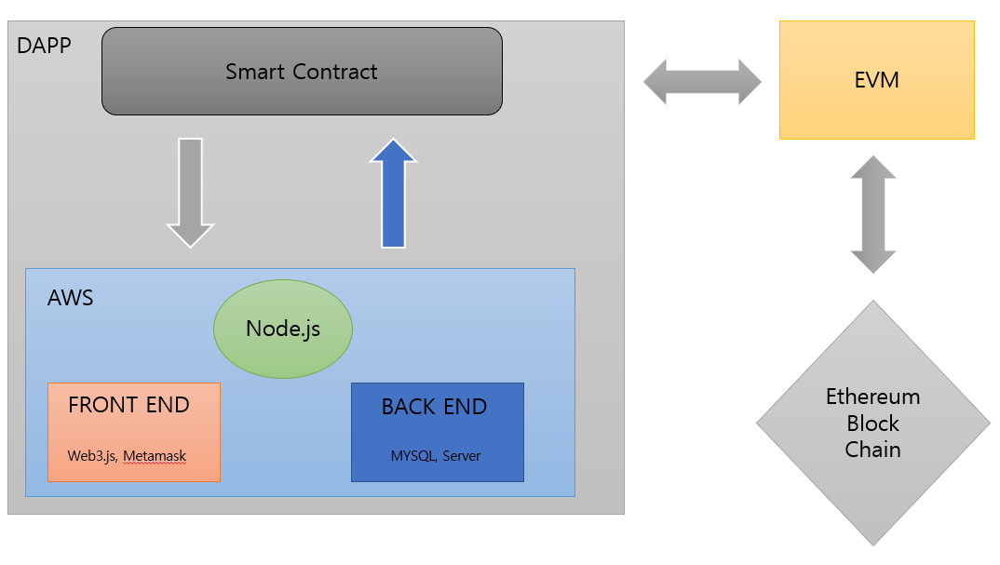
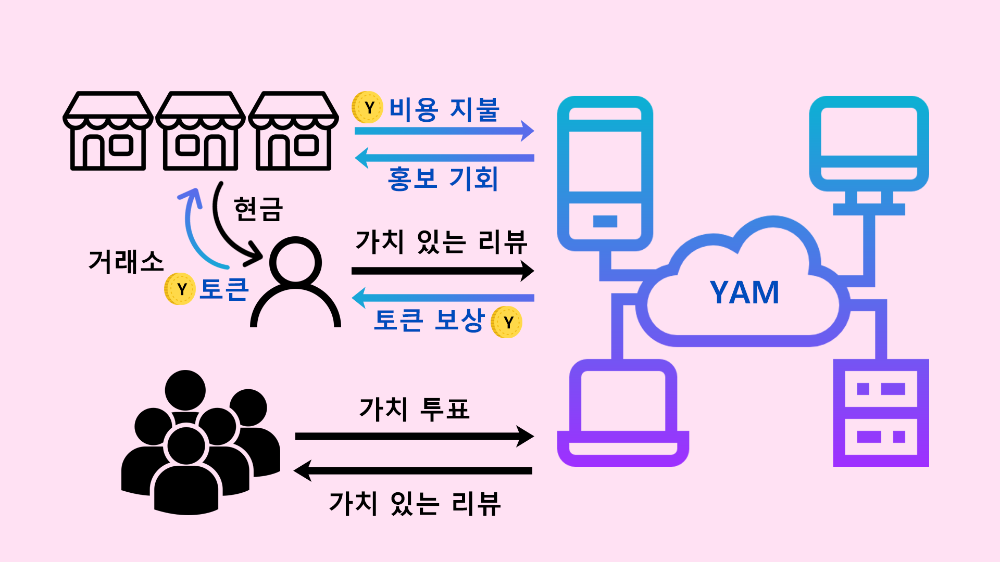

Yamconomy
=========
# 1. What is Yamconomy?
## "Yamconomy" is a project focused at creating a wholesome review ecosystem using blockchain technology.

### 1.2 Diagram

### 1.3 ecosystem

# 2.  How to Run
### 1. __truffle migrate --compile-all --reset --network ganache__  
(If you want Run on Ganache with Compile & Reset)  
  
1-1. __truffle console --network ganache__	(Truffle console Run on Ganache)  
1-2. __Yamconomy.deployed().then(function(instance) {app = instance;})__	(Make Instance app)  
1-3. __app.FunctionName(Parameter)__  
	
### 2. Run CMD or Power Shell  
2-1 Go to Yamconomy path  
2-2 __npm install__	(Install Lite Server & DAPP Module)  
2-3 __npm run dev__		(Run DAPP with Lite Server)  

