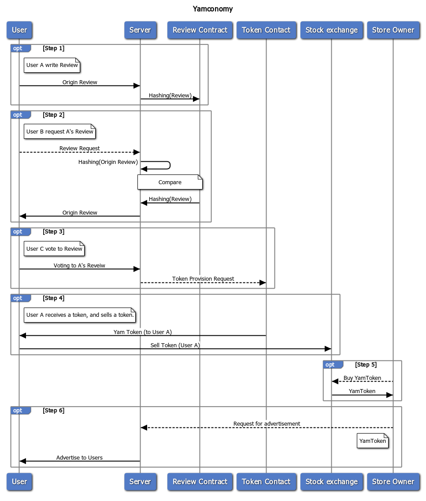

# Yamconomy

# What is Yamconomy?
## "Yamconomy" is a project focused at creating a wholesome review ecosystem using blockchain technology.

## Diagram

## ecosystem

## Sequence Diagram

## An introductory video.
https://www.youtube.com/watch?v=6vyz8LkPKZs

## Add DataBase

### Account Table

| ID | PW(SHA-256) | Meta mask Account |
|----|----------------|-----------------------|
| YoonSung | 123    |45678919|
| NULL    | NULL  | NULL         |

----

### Review Table

| ID | Voting count | Writing number | Title | Body | Image|
|---|---------------|-------------------|-------|-------|-------|
| YoonSung| 12 | 1                       |	A    |  abcd | NULL |

----

### Temp Table

**This is initialized every week**

| ID | Vote count |
|---|--------------|
|YoonSung|  3   |